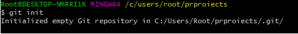
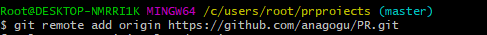
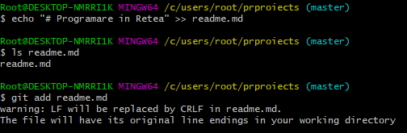
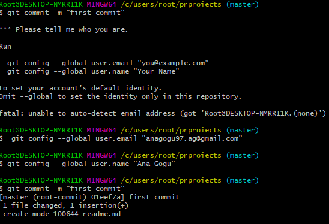
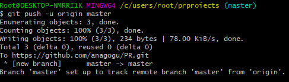

# Programare in Retea 
### Laboratorul 1 

*Scopul lucrarii:* 
   Studiul si intelegerea principiilor de functionare si utilizare a sistemului
 distribuit de control al versiunilor numit GIT. 

*Desfasurarea lucrarii:* 
   In aceasta lucrare de laborator am facut cunostinta cu git, utilizind unele
comenzi simple cum ar fi cele pentru crearea unui repozitoriu si de transfer
a datelor de pe repozitoriul local(de pe calculatorul personal) pe cel localizat
pe github.com

    Pentru inceput am creat un nou repozitoriu pe care l-am numit PR(abreviere de la Programarea in Retea) 
 

   Dupa care utilizind gitbash am initializat un repozitoriu in calculatorul meu. 
 

   Apoi a urmat adaugarea la distanta a originii. 

   Pentru a testa si a face cunostinta mai indeaproape cu posibilitatiele git-ului
am utilizat comanda "echo" pentru a scrie din linia de comanda in fisierul "readme.md".
Dupa care am interprins pasii pentru tranferarea informatie pe repozitoriul git. 

   Cind am introdus pentru prima oara comanda "git commit -m"(pentru a inregistra 
versiunea fisierului) m-am ciocnit cu necesitatea de a ma autentifica, deci: 

   In cele din urma am folosit comanda "git push -u origin master" pentru a reinoi
repozitoriul distant aflindu-ma pe ramura master. 

  Desigur ciclul dat a fost repetat de mai multe ori, pentru ca fisierul "readme.md"
a fost modificat de mai multe ori. 

##### A realizat: Ana Gogu