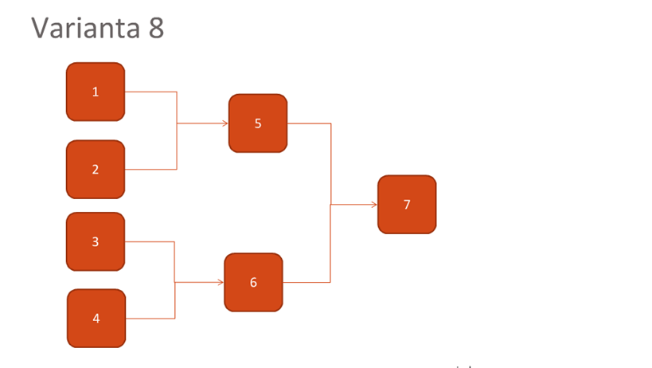
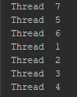
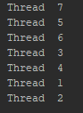

# Programare in Retea</br>
### Laboratorul 2</br>

*Scopul lucrarii:*</br>
   Programarea Multi-threading. Sincronizarea firelor de executie


*Desfasurarea lucrarii:*</br>
   Pentru a efectua lucrarea de laborator nr.2 eu am ales limbajul de programare JAVA.
Initial, pentru a efectua lucrarea de laborator a fost nevoie de studierea mai aprofundata 
a firelor de executie, a semafoarelor, mutexului, pentru a putea alege solutia potrivita
a sarcinii propuse, si anume:


   Conceptul de thread (fir de executie) defineste cea mai mica unitate de procesare ce 
poate fi programata spre executie de catre sistemul de operare. Este folosit in programare
 pentru a eficientiza executia programelor.

   Mutexurile sunt obiecte de sincronizare utilizate pentru a asigura accesul exclusiv la o seciune de cod in care
se acceseaza date partajate intre doua sau mai multe fire de executie. Un mutex are doua stari posibile: ocupat si
liber. Un mutex poate fi ocupat de un singur fir de execuie la un moment dat. Atunci cand un mutex este
ocupat de un fir de execuie, el nu mai poate fi ocupat de niciun altul. In acest caz, o cerere de ocupare venita
din partea unui alt fir, in general va bloca firul pina in momentul in care mutexul devine liber.
   Deci, in cazul meu, mutexul nu este tocmai alegerea cea mai potrivita.

   Semafoarele sunt obiecte de sincronizare ce reprezinta o generalizare a mutexurilor prin aceea ca salveaza
numarul de operaii de eliberare (incrementare) efectuate asupra lor. Practic, un semafor reprezinta un intreg
care se incrementeaza/decrementeaza atomic. Valoarea unui semafor nu poate scadea sub 0. Daca semaforul
are valoarea 0, operaia de decrementare se va bloca pina cind valoarea semaforului devine strict pozitiva.
Mutexurile pot fi privite, asadar, ca nite semafoare binare.
   Alegerea mea sa oprit asupra semafoarelor.

### COdul sursa al programului

```
package com.ana;

import java.util.concurrent.Semaphore;

public class Main {

    public static void main(String[] args) {

        Semaphore sem1 = new Semaphore(0);
        Semaphore sem2 = new Semaphore(0);
        Semaphore sem3 = new Semaphore(0);
        Semaphore sem4 = new Semaphore(0);
        Semaphore sem5 = new Semaphore(0);
        Semaphore sem6 = new Semaphore(0);
        Semaphore sem7 = new Semaphore(0);

        //new Runnable()
        //7 is not dependent
        new Thread(() -> Release("7",sem7)).start();

        new Thread(() -> {
            //5 and 6 depend on 7
            try {
                sem7.acquire();
                Release("5",sem5);
                Release("6",sem6);
            } catch (Exception e) {
                e.printStackTrace();
            }
        }).start();

        new Thread(() -> {
            //3 and 4 depend on 6
            try {
                sem6.acquire();
                Release("3",sem3);
                Release("4",sem4);
            } catch (Exception e) {
                e.printStackTrace();
            }
        }).start();

        new Thread(() -> {
            //1 and 2 depend on 5
            try {
                sem5.acquire();
                Release("1",sem1);
                Release("2",sem2);
            } catch (Exception e) {
                e.printStackTrace();
            }
        }).start();

    }

    private static void Release(String nr, Semaphore semaphoreToRelease){

        try {
            System.out.printf("Thread  %s\n",nr);
            semaphoreToRelease.release();
        } catch (Exception e) {
            e.printStackTrace();
        }
    }
}
```
Scopul nostru a fost studiul sincronizarii, deci, toate firele sunt create 
in acelasi timp. Spre deosebire de mutex, semaforul se initiaza cu valoarea 0.
In program sunt folosite blocurile try/catch pentru a evita erorile si iesirile
 nedorite din program, atunci cind valoarea este 0. Fiecare acquire () blocheaza,
 daca este necesar, pina cind este disponibila o permisiune si apoi o ia. 
Fiecare release () adauga un permis, eliberind un posibil fir blocat.

   Observam ca la rularea multipla a programului putem obtine rezultate diferite.
Aceasta se datoreaza faptului ca la anumite nivele mai multe fire de executie pot
accesa aceleasi resurse.
     