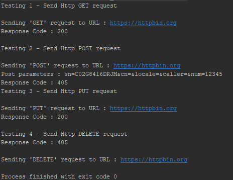
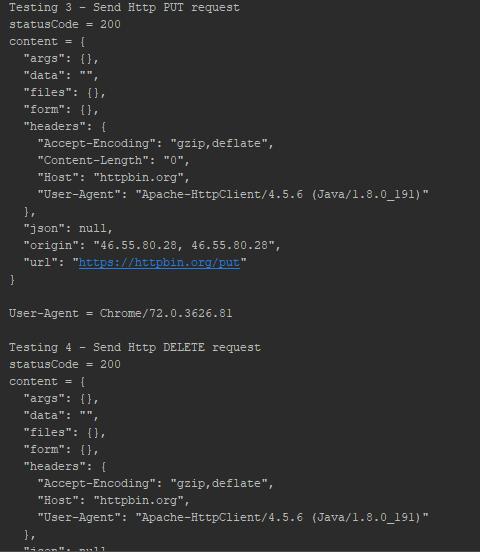

# Programare in Retea</br>
### Laboratorul 3</br>

*Scopul lucrarii:*</br>
  Studierea Protocolului HTTP si descoperirea posibilitatilor acestuia

*Desfasurarea lucrarii:*</br>
GET</br>
Metoda GET solicita o reprezentare a resursei specificate. Cererile care
 utilizeaza GET ar trebui sa recupereze numai datele si nu ar trebui sa aiba alt efect.

POST</br>
Metoda POST cere ca serverul sa accepte entitatea inclusa in cerere ca un nou subordonat
 al resursei web identificate de URI. Datele postate pot fi, de exemplu, o adnotare pentru
 resursele existente; un mesaj pentru un buletin de bord, grup de stiri, lista de discutii
 sau un comentariu; un bloc de date care este rezultatul trimiterii unui formular web la un
 proces de prelucrare a datelor; sau un element de adaugat la o baza de date.

PUT</br>
Metoda PUT cere ca entitatea inclusa sa fie stocata sub URI furnizat. Daca URI se refera la o
 resursa deja existenta, este modificata; daca URI nu indica o resursa existenta, atunci serverul
 poate crea resursa cu acel URI.

DELETE</br>
Metoda DELETE sterge resursa specificata.

1xx (Informational): Cererea a fost primita, proces continuu</br>
2xx (reusita): Solicitarea a fost primita, inteleasa si acceptata cu succes</br>
3xx (redirectionare): Trebuie sa se actioneze in continuare pentru a completa solicitarea</br>
4xx (Eroare client): Solicitarea contine o sintaxa incorecta sau nu poate fi indeplinita</br>
5xx (Eroare server): Serverul nu a reusit sa indeplineasca o cerere aparent valida</br>
Codul obtinut in cazul meu este 200 de aici rezulta ca raspunsul e O.K.
Raspunsul standard pentru solicitarile HTTP de succes. Raspunsul real va depinde de metoda 
de solicitare utilizata. intr-o solicitare GET, raspunsul va contine o entitate 
corespunzatoare resursei solicitate. intr-o cerere POST, raspunsul va contine o entitate 
care descrie sau contine rezultatul actiunii.

### COdul sursa al programului
#### Main.java
```
package com.ana;

public class Main {

    public static void main(String[] args) throws Exception {
            HttpURLConnectionExample http = new HttpURLConnectionExample();

            System.out.println("Testing 1 - Send Http GET request");
            http.sendGet();

            System.out.println("\nTesting 2 - Send Http POST request");
            http.sendPost();

            System.out.println("Testing 3 - Send Http PUT request");
            http.sendPut();

            System.out.println("\nTesting 4 - Send Http DELETE request");
            http.sendDelete();

    }
}
```
#### Clasa "HttpURLConnectionExample"
```
package com.ana;

import org.apache.http.HttpResponse;
import org.apache.http.client.methods.*;
import org.apache.http.impl.client.CloseableHttpClient;
import org.apache.http.impl.client.HttpClientBuilder;
import org.apache.http.util.EntityUtils;

import java.io.DataOutputStream;
import java.net.HttpURLConnection;
import java.net.URL;


public class HttpURLConnectionExample {
     private final String USER_AGENT = "Chrome/72.0.3626.81";


    public void sendGet() throws Exception {
        CloseableHttpClient httpClient = HttpClientBuilder.create().build();
        HttpGet getRequest = new HttpGet("https://httpbin.org/get");

        try (CloseableHttpResponse httpResponse = httpClient.execute(getRequest)) {
            statusMetode(httpResponse);

        } catch (Exception e) {
            e.printStackTrace();
        }

    }

    // HTTP POST request
    public void sendPost() throws Exception {

        CloseableHttpClient httpClient = HttpClientBuilder.create().build();
        HttpPost postRequest = new HttpPost("https://httpbin.org/post");

        try (CloseableHttpResponse httpResponse = httpClient.execute(postRequest)) {
            statusMetode(httpResponse);

        } catch (Exception e) {
            e.printStackTrace();
        }

    }

    // HTTP PUT request
    public void sendPut() {
        CloseableHttpClient httpClient = HttpClientBuilder.create().build();
        HttpPut putRequest = new HttpPut("https://httpbin.org/put");

            try (CloseableHttpResponse httpResponse = httpClient.execute(putRequest)) {
                statusMetode(httpResponse);

            } catch (Exception e) {
                e.printStackTrace();
            }

    }

    // HTTP DELETE request
    public void sendDelete() {
        CloseableHttpClient httpClient = HttpClientBuilder.create().build();
        HttpDelete deleteRequest = new HttpDelete("https://httpbin.org/delete");

        try (CloseableHttpResponse httpResponse = httpClient.execute(deleteRequest)) {
            statusMetode(httpResponse);

        } catch (Exception e) {
            e.printStackTrace();
        }

    }

    public void statusMetode(HttpResponse httpResponse) throws Exception {

        String content = EntityUtils.toString(httpResponse.getEntity());

        String url = "https://httpbin.org";
        URL obj = new URL(url);
        HttpURLConnection con = (HttpURLConnection) obj.openConnection();
        int statusCode = httpResponse.getStatusLine().getStatusCode();
        con.setRequestProperty("User-Agent", USER_AGENT);
        con.setDoOutput(true);
        DataOutputStream wr = new DataOutputStream(con.getOutputStream());
        System.out.println("statusCode = " + statusCode);
        System.out.println("content = " + content);
        System.out.println("User-Agent = " + USER_AGENT);
        wr.flush();
        wr.close();
    }
}


```
### Rezultatul rularii
 
 


