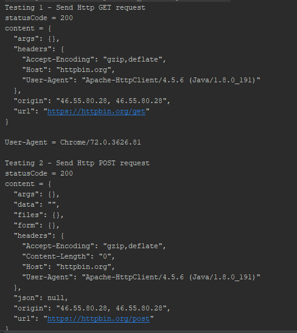

# Programare in Retea</br>
### Laboratorul 3</br>

*Scopul lucrarii:*</br>
  Studierea Protocolului HTTP si descoperirea posibilitatilor acestuia

*Desfasurarea lucrarii:*</br>
GET
Metoda GET solicita o reprezentare a resursei specificate. Cererile care
 utilizeaza GET ar trebui sa recupereze numai datele si nu ar trebui sa aiba alt efect.

POST
Metoda POST cere ca serverul sa accepte entitatea inclusa in cerere ca un nou subordonat
 al resursei web identificate de URI. Datele postate pot fi, de exemplu, o adnotare pentru
 resursele existente; un mesaj pentru un buletin de bord, grup de stiri, lista de discutii
 sau un comentariu; un bloc de date care este rezultatul trimiterii unui formular web la un
 proces de prelucrare a datelor; sau un element de adaugat la o baza de date.

PUT
Metoda PUT cere ca entitatea inclusa sa fie stocata sub URI furnizat. Daca URI se refera la o
 resursa deja existenta, este modificata; daca URI nu indica o resursa existenta, atunci serverul
 poate crea resursa cu acel URI.

DELETE
Metoda DELETE sterge resursa specificata.

### COdul sursa al programului
#### Main.java
```
package com.ana;

public class Main {

    public static void main(String[] args) throws Exception {
            HttpURLConnectionExample http = new HttpURLConnectionExample();

            System.out.println("Testing 1 - Send Http GET request");
            http.sendGet();

            System.out.println("\nTesting 2 - Send Http POST request");
            http.sendPost();

            System.out.println("Testing 3 - Send Http PUT request");
            http.sendPut();

            System.out.println("\nTesting 4 - Send Http DELETE request");
            http.sendDelete();

    }
}
```
#### Clasa "HttpURLConnectionExample"
```
package com.ana;

import java.io.DataOutputStream;
import java.io.IOException;
import java.net.HttpURLConnection;
import java.net.MalformedURLException;
import java.net.URL;

public class HttpURLConnectionExample {
    private final String USER_AGENT = "Chrome/72.0.3626.81";

    public void sendGet() throws Exception {

        String url = "https://httpbin.org";

        URL obj = new URL(url);
        HttpURLConnection con = (HttpURLConnection) obj.openConnection();

        // optional default is GET
        con.setRequestMethod("GET");

        //add request header
        con.setRequestProperty("User-Agent", USER_AGENT);

        int responseCode = con.getResponseCode();
        System.out.println("\nSending 'GET' request to URL : " + url);
        System.out.println("Response Code : " + responseCode);

    }

    // HTTP POST request
    public void sendPost() throws Exception {

        String url = "https://httpbin.org";
        URL obj = new URL(url);
        HttpURLConnection con = (HttpURLConnection) obj.openConnection();

        //add reuqest header
        con.setRequestMethod("POST");
        con.setRequestProperty("User-Agent", USER_AGENT);
        con.setRequestProperty("Accept-Language", "en-US,en;q=0.5");

        String urlParameters = "sn=C02G8416DRJM&cn=&locale=&caller=&num=12345";

        // Send post request
        con.setDoOutput(true);
        DataOutputStream wr = new DataOutputStream(con.getOutputStream());
        wr.writeBytes(urlParameters);
        wr.flush();
        wr.close();

        int responseCode = con.getResponseCode();
        System.out.println("\nSending 'POST' request to URL : " + url);
        System.out.println("Post parameters : " + urlParameters);
        System.out.println("Response Code : " + responseCode);

    }

    // HTTP PUT request
    public void sendPut() throws Exception {
        URL url = null;
        URL obj = new URL("https://httpbin.org");
        HttpURLConnection con = (HttpURLConnection) obj.openConnection();
        try {
            url = new URL("https://httpbin.org");
        } catch (MalformedURLException exception) {
            exception.printStackTrace();
        }
        HttpURLConnection httpURLConnection = null;
        DataOutputStream dataOutputStream = null;
        try {
            httpURLConnection = (HttpURLConnection) url.openConnection();
            httpURLConnection.setRequestProperty("Content-Type", "application/x-www-form-urlencoded");
            httpURLConnection.setRequestMethod("PUT");
            httpURLConnection.setDoInput(true);
            httpURLConnection.setDoOutput(true);
            dataOutputStream = new DataOutputStream(httpURLConnection.getOutputStream());
            int responseCode = con.getResponseCode();
            System.out.println("\nSending 'PUT' request to URL : " + url);
            System.out.println("Response Code : " + responseCode);
        } catch (IOException exception) {
            exception.printStackTrace();
        } finally {
            if (dataOutputStream != null) {
                try {
                    dataOutputStream.flush();
                    dataOutputStream.close();
                } catch (IOException exception) {
                    exception.printStackTrace();
                }
            }
            if (httpURLConnection != null) {
                httpURLConnection.disconnect();
            }
        }
    }
    // HTTP DELETE request
    public void sendDelete() throws Exception {
        URL url = null;

        try {
            url = new URL("https://httpbin.org");
        } catch (MalformedURLException exception) {
            exception.printStackTrace();
        }
        HttpURLConnection httpURLConnection = null;
        try {
            httpURLConnection = (HttpURLConnection) url.openConnection();
            httpURLConnection.setRequestProperty("Content-Type",
                    "application/x-www-form-urlencoded");
            httpURLConnection.setRequestMethod("DELETE");
            System.out.println("Response Code : " + httpURLConnection.getResponseCode());
            System.out.println("\nSending 'DELETE' request to URL : " + url);
        } catch (IOException exception) {
            exception.printStackTrace();
        } finally {
            if (httpURLConnection != null) {
                httpURLConnection.disconnect();
            }
        }
    }
}

```
### Rezultatul rularii
 


